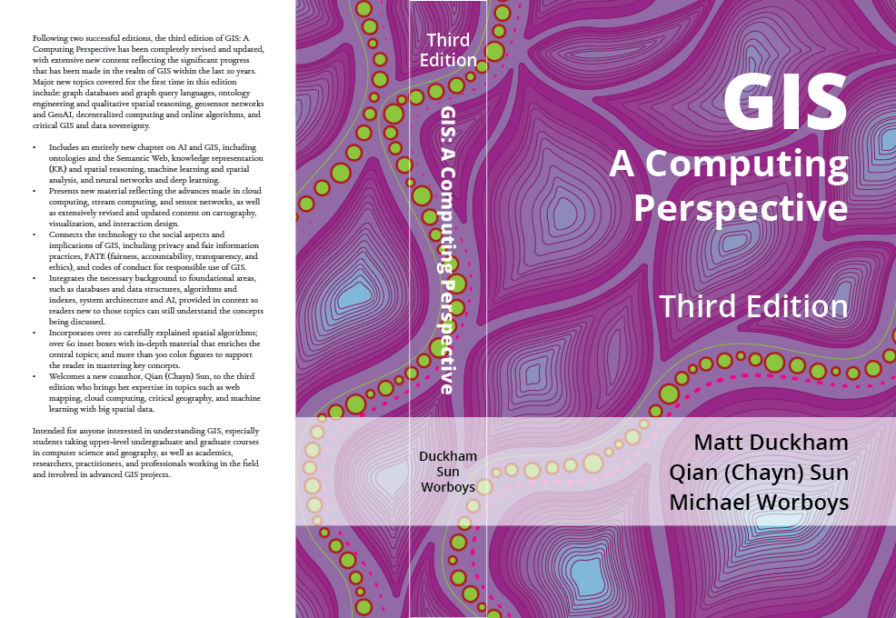

# GIS: A Computing Perspective, Third Edition, Companion material

This repository hosts companion material to accompany the third edition of the textbook "GIS: A Computing Perspective". 

> Duckham, Matt; Sun, Qian (Chayn); Worboys, Michael F. (2024) *GIS: A Computing Perspective*, Third Edition, CRC Press, [doi:10.1201/9780429168093](https://doi.org/10.1201/9780429168093) 

Other important online resources connected with the textbook include:

- The book website: [gisacp.duckham.org](https://gisacp.duckham.org)
- The publisher's website: [www.taylorfrancis.com](https://www.taylorfrancis.com/books/mono/10.1201/9780429168093/gis-matt-duckham-michael-worboys-qian-chayn-sun)
- Open access chapters on OAPEN: [library.oapen.org](https://library.oapen.org/handle/20.500.12657/75328)

## Instructor and student resources 

The following resources for students and instructors are in development. If you are a GIS instructor have a request to prioritise particular resources, please [contact the authors](http://gisacp.duckham.org/questions-about-the-book/). 

- Downloadable PDFs for 5 open access chapters (Chapters 1, 2, 3, 8, 9) \[complete\]
- Audiobook chapters (complete mp3 or set of zipped mp3 sections) for 5 open access chapters (Chapters 1, 2, 3, 8, 9) \[in progress\]
- Outline presentation slides in MS Powerpoint and Google Slides for all chapters \[in progress\]

| Chapter | Title | PDF | Audiobook | Presentation slides 
| ----------- | ----------- |  ----------- |  ----------- |  ----------- 
| 1 | Introduction | \[[repo](oa_chapters/10.1201_9780429168093-1_chapterpdf.pdf) \| [online](https://www.taylorfrancis.com/chapters/oa-mono/10.1201/9780429168093-1/introduction-matt-duckham-qian-chayn-sun-michael-worboys)\]| \[[single mp3](https://drive.google.com/file/d/1HC90uSl3j7szZKYOulYsGbJvh1gGL53i/view?usp=drive_link) read by AI\] | 
\[[google](https://docs.google.com/presentation/d/1NWYgRgmdm1eYZJLnw9WCQvB-Zsl_Td-v6Vny1UvYNTc/edit?usp=sharing) \| [pptx](pptx/gisacp-chapter1.pptx)\]
| 2 | Fundamental Database Concepts | \[[repo](oa_chapters/10.1201_9780429168093-2_chapterpdf.pdf) \| [online](https://www.taylorfrancis.com/chapters/oa-mono/10.1201/9780429168093-2/fundamental-database-concepts-matt-duckham-qian-chayn-sun-michael-worboys)\]| \[[single mp3](https://drive.google.com/file/d/1HC90uSl3j7szZKYOulYsGbJvh1gGL53i/view?usp=sharing) read by AI\] |  \[[google](https://docs.google.com/presentation/d/1TbfpkpRY4xBJ0dChQytd_PcJyZHgN-OyyIYIZXY63yM/edit?usp=sharing) \| [pptx](pptx/gisacp-chapter2.pptx)\]
| 3 | Fundamental Spatial Concepts | \[[repo](oa_chapters/10.1201_9780429168093-3_chapterpdf.pdf) \| [online](https://www.taylorfrancis.com/chapters/oa-mono/10.1201/9780429168093-3/fundamental-spatial-concepts-matt-duckham-qian-chayn-sun-michael-worboys)\]| expected 10/24 | expected 04/24
| 4 | Models of Geospatial Information | not available | not available | expected 12/24 
| 5 | Representation and Algorithms | not available | not available | expected 12/24 
| 6 | Structures and Access Methods  | not available | not available | expected 12/24 
| 7 | Architectures | not available | not available | expected 12/24 
| 8 | Cartography and Geovisualization | \[[repo](oa_chapters/10.1201_9780429168093-8_chapterpdf.pdf) \| [online](https://www.taylorfrancis.com/chapters/oa-mono/10.1201/9780429168093-8/cartography-geovisualization-matt-duckham-qian-chayn-sun-michael-worboys)\]| \[[single mp3](https://drive.google.com/file/d/1v3AHfFBw4bGLoOfHn6nkqsI_afM_v03E/view?usp=sharing) \| [section zip](https://drive.google.com/file/d/1PjuzH5pJT15EkQ3ZQUNFexsqw4xMlO8U/view?usp=sharing)\] | \[[google](https://docs.google.com/presentation/d/1bx_zFJgwUCaFQ0fe6vly8xYS2Z8cmiJhZJXhO6PeqBE/edit?usp=sharing) \| [pptx](pptx/gisacp-chapter8.pptx)\]
| 9 | Artificial Intelligence and GIS | \[[repo](oa_chapters/10.1201_9780429168093-9_chapterpdf.pdf) \| [online](https://www.taylorfrancis.com/chapters/oa-mono/10.1201/9780429168093-9/artificial-intelligence-gis-matt-duckham-qian-chayn-sun-michael-worboys)\]| \[[single mp3](https://drive.google.com/file/d/1yTvvHT55mWHtxt8cQ9K6xhcxqdhv81w2/view?usp=sharing) \| [section zip](https://drive.google.com/file/d/1Tr_8NCmx9dLJ3m2nZaqmSoS6tC5IAcri/view?usp=sharing)\] | \[[google](https://docs.google.com/presentation/d/10kHL7FGoR3ukjrjIfrBGGCiDQts_cFc96TKkw3Aq2cE/edit?usp=sharing) \| [pptx](pptx/gisacp-chapter9.pptx)\]
| 10 | Spatial Information in Context | not available | not available | expected 12/24 

## Practical material 

A range of related practicals exists or are in development that may be useful when teaching certain chapters from the book. 

### Relational spatial databases

With acknowledgements to Martin Tomko, a set of spatial relational database practicals were developed in 2006-2008 using Oracle Spatial database, as part of Masters/advanced Undergraduate level courses at the University of Melbourne and RMIT University, related to Chapter 2, Fundamental Database Concepts. The practicals have not been updated to contemporary DBMS software, but may still be useful as a basis for spatial database courses in connection with Chapter 2. 

- Spatial databases practical: Introduction to SQL [rdb-p1](pracs/rdb/rdb-p1.html)
- Spatial databases practical: Oracle Spatial [rdb-p2](pracs/rdb/rdb-p2.html)
- Spatial databases practical: Spatial analysis [rdb-p3](pracs/rdb/rdb-p3.html)
- Spatial databases practical: Network analysis [rdb-p4](pracs/rdb/rdb-p4.html)

### Data graphics

Two introductory practical activities taught in 2017 as part of Masters/advanced Undergraduate level courses at the University of Melbourne and RMIT University, related to Chapter 8, Cartography and Geovisualisation. 

- Data graphics practical: Critiquing data graphics [dg-cex](pracs/datagraphics/dg-cex.html)
- Data graphics practical: Data graphics with spreadsheets [dg-lab](pracs/datagraphics/dg-lab.html)

## Other resources 

A full table of contents to the third edition is included in [pdf](misc/gisacp-toc.pdf) and [plain text](misc/toc.md). 

An index of over 1200 terms used in the third edition is also included in [pdf](misc/gisacp-index.pdf) and [plain text](misc/index.md). 

The preface to the third edition is also available in [pdf](misc/gisacp-preface.pdf) as is the bibliography in [pdf](misc/gisacp-bibliography.pdf) and Appendix A in [pdf](misc/gisacp-appendixa.pdf) 

## Instructor resources (Second edition, archived)

While the presentation slides for the new, third edition are in preparation, the slides to accompany the 2004 second edition of the book are also archived in this repository. 

| Chapter | Title | Presentation slides 
| ----------- | ----------- |  ----------- | 
| 1 | Introduction | [chapter1.ppt](archive_ppt/chapter1.ppt)
| 2 | Fundamental database concepts | [chapter2.ppt](archive_ppt/chapter2.ppt)
| 3 | Fundamental spatial concepts | [chapter3.ppt](archive_ppt/chapter3.ppt)
| 4 | Models of geospatial information | [chapter4.ppt](archive_ppt/chapter4.ppt)
| 5 | Representation and algorithms | [chapter5.ppt](archive_ppt/chapter5.ppt)
| 6 | Structures and access methods | [chapter6.ppt](archive_ppt/chapter6.ppt)
| 7 | Architectures | [chapter7.ppt](archive_ppt/chapter7.ppt)
| 8 | Interfaces | [chapter8.ppt](archive_ppt/chapter8.ppt)
| 9 | Spatial reasoning and uncertainty | [chapter9.ppt](archive_ppt/chapter9.ppt)
| 10 | Time | [chapter10.ppt](archive_ppt/chapter10.ppt)
